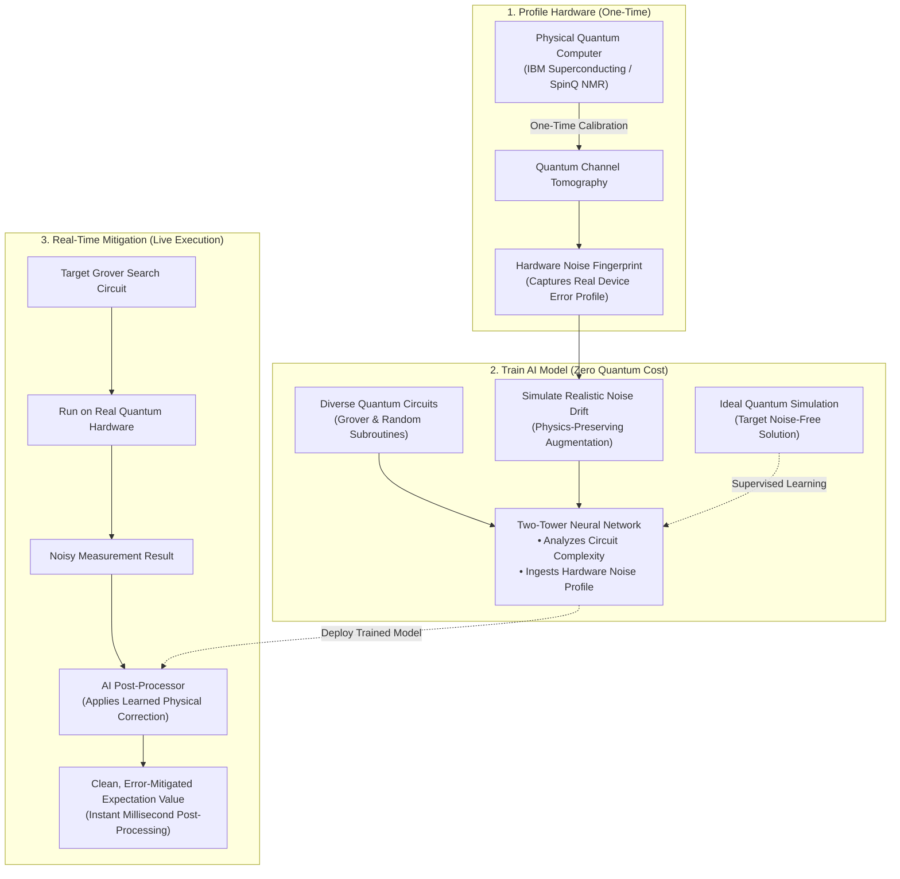
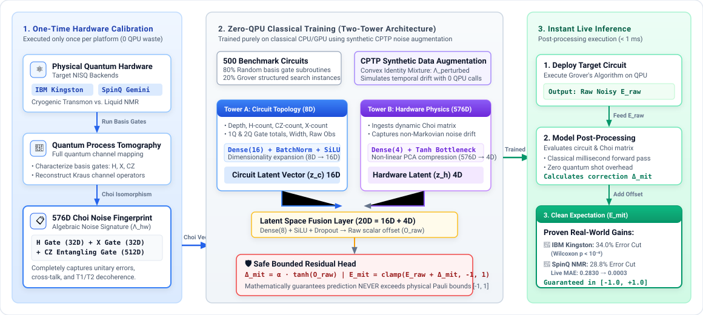

# Cross-Platform Machine Learning Quantum Error Mitigation (ML-QEM) for Grover's Algorithm

[](https://opensource.org/licenses/MIT)
[](https://www.python.org/downloads/)
[](https://qiskit.org/)
[](https://pytorch.org/)

This repository contains the implementation, datasets, and experimental evaluation for our research paper:  
**"Cross-Platform Machine Learning Quantum Error Mitigation (ML-QEM) for Grover's Algorithm: A Comparative Study between Superconducting and NMR Architectures"**.

---

## 💡 The Core Idea (In Plain English)

Today's quantum computers (NISQ devices) are inherently noisy. As quantum algorithms grow deeper—like **Grover's search algorithm** with repeated oracle and diffusion cycles—physical noise rapidly scrambles quantum information into pure randomness.

Traditional Quantum Error Mitigation (like ZNE or PEC) helps, but requires running thousands of extra quantum circuits on physical hardware, creating massive queue times and sampling costs.

**Our Solution:**  
We introduce a **Two-Tower Neural Network** that acts as an intelligent, instantaneous classical post-processor:
1. **Zero-QPU Training Overhead:** Instead of burning expensive quantum hardware time to collect training data, we characterize the hardware's noise **just once** using a mathematical fingerprint called the **Choi Matrix**.
2. **Synthetic Physics-Preserving Augmentation:** During offline training on a classical computer, we dynamically fluctuate this noise fingerprint using a technique that strictly obeys quantum mechanics (CPTP preservation). This teaches the neural network how real hardware drifts over time at **zero hardware cost**.
3. **Safe Bounded Corrections:** The model predicts a corrective offset $\Delta_{mit}$ constrained by physical safety bounds, mathematically guaranteeing the final answer can never exceed physical quantum limits ($[-1, 1]$).
4. **Instant Classical Post-Processing:** During live execution, noisy measurements from real QPUs are corrected in milliseconds with zero extra quantum shots.

---

## 🗺️ High-Level System Architecture



### 📐 Detailed Architecture & Pipeline Flow
For deeper technical insight into the latent space dimensions, non-linear activation bottlenecks, and bounded residual formulation, see the architecture schema below:

<p align="center">
  
</p>

---

## 🔬 Cross-Platform Empirical Highlights

We benchmarked the pipeline across two fundamentally different physical computing paradigms exhibiting an initial **$\sim$200-fold noise disparity**:

| Benchmark Dimension | IBM Kingston (Superconducting) | SpinQ Gemini (Liquid-State NMR) |
| :--- | :--- | :--- |
| **Qubit Modality** | 127-Qubit Cryogenic Transmons (~15 mK) | 2-Qubit Room-Temperature NMR ($^1$H and $^{31}$P) |
| **Primary Noise Source** | Microwave cross-talk, pulse miscalibrations | Severe phase damping ($T_2$) from slow J-coupling (~800 $\mu$s) |
| **Pre-Mitigation Raw MSE** | 0.00048 | 0.09610 (~200x noisier) |
| **Mitigation Bound ($\alpha$)** | $\alpha = 0.2$ (tightly constrained) | $\alpha = 1.0$ (expanded for severe dephasing) |
| **Error Reduction (Unseen Test)** | **34.0%** error reduction ($p < 10^{-6}$) | **28.8%** error reduction ($p = 0.000510$) |
| **Live Real-Time Hardware Inference** | Robust depth generalization across layers | Raw MAE **0.2830 $\to$ 0.0003** ($p = 0.000001$) |

*Statistical significance verified using the non-parametric Wilcoxon Signed-Rank Test across non-overlapping circuit distributions.*

---

## 📂 Project Structure

```text
├── notebooks/
│   ├── 1_Grover_Error_Mitigation.ipynb    # Core Grover's algorithm & noise baseline analysis
│   ├── 2_ML_QEM_Pipeline_IBM.ipynb        # Complete Two-Tower pipeline for IBM Superconducting QPU
│   └── 3_ML_QEM_Pipeline_NMR.ipynb        # Adapted ML-QEM pipeline for SpinQ Gemini NMR QPU
├── data/
│   ├── ibm_cloud_data/                    # Choi matrices (.npy) and trained model weights (.pt)
│   ├── nmr_data/                          # SpinQ dataset (.csv), Choi fingerprints, and live inference runs
│   └── simulation_data/                   # Loss curves, validation splits, and metric plots
├── scripts/
│   ├── spinq_dataset_gen.py               # Robust remote execution wrapper for SpinQ cloud QPU
│   ├── spinq_dataset_gen_extended.py      # Extended dataset generator for out-of-distribution depths
│   ├── spiqit_simulation.py               # SpinQ local simulator integration
│   └── test_connection.py                 # Remote backend health-check utility
└── README.md
```

---

## 🛠️ Getting Started

### 1. Clone the Repository
```bash
git clone https://github.com/KasunikaKarunarathne/QEM-Grover-Mitigation.git
cd QEM-Grover-Mitigation
```

### 2. Environment Setup
```bash
conda create -n ml-qem python=3.10 -y
conda activate ml-qem
pip install torch torchvision numpy scipy pandas matplotlib qiskit qiskit-aer
```

### 3. Reproducing the Experiments
Open the respective Jupyter notebooks in `notebooks/`:
- Run `2_ML_QEM_Pipeline_IBM.ipynb` to inspect IBM Kingston data, training with CPTP augmentation, and test evaluations.
- Run `3_ML_QEM_Pipeline_NMR.ipynb` to evaluate the SpinQ Gemini NMR dephasing mitigation and live QPU deployment results.

---

## 📜 Citation & Code Availability
The code and datasets in this repository accompany our research paper. If you utilize this framework or datasets in your research, please cite:

```bibtex
@article{karunarathne2026crossplatform,
  title={Cross-Platform Machine Learning Quantum Error Mitigation (ML-QEM) for Grover's Algorithm: A Comparative Study between Superconducting and NMR Architectures},
  author={Karunarathne, Nethmini and Mahasinghe, Anuradha},
  journal={CLEI Electronic Journal},
  year={2026}
}
```
